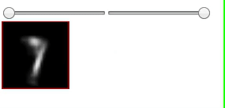
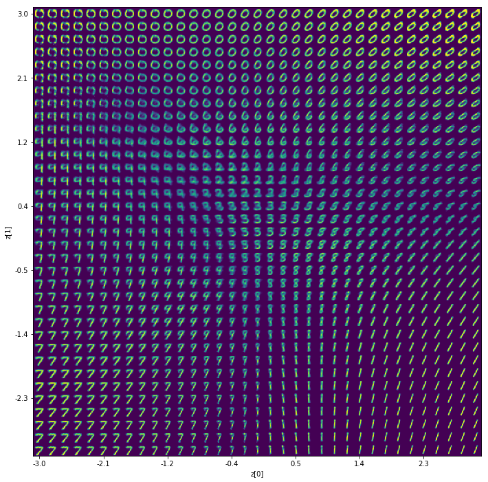
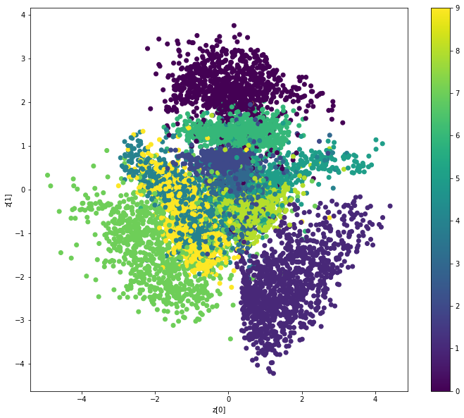

# VAE Experiment

[Working Demo](http://vae-experiment.s3-website.eu-west-2.amazonaws.com)



## Steps

### 1. Train the model

Open and Run `/model/variational-auto-encoder-mnist.ipbn`

You'll see awesome data visualizations here like this Manifold:



And this latent space distribution:



### 2. Conver the model from `.h5` to `tensorflow.js`

```bash
tensorflowjs_converter --input_format keras /Users/pedro/Documents/rants/basic-ae/vae/model/decoder_mlp_mnist.h5 /Users/pedro/Documents/rants/basic-ae/vae/model
```

note: replace `/Users/pedro/Documents/rants/basic-ae/vae/` with the location on this file on your machine

### 3. Run the client

```
cd client # from the root folder
npm i
npm start
```